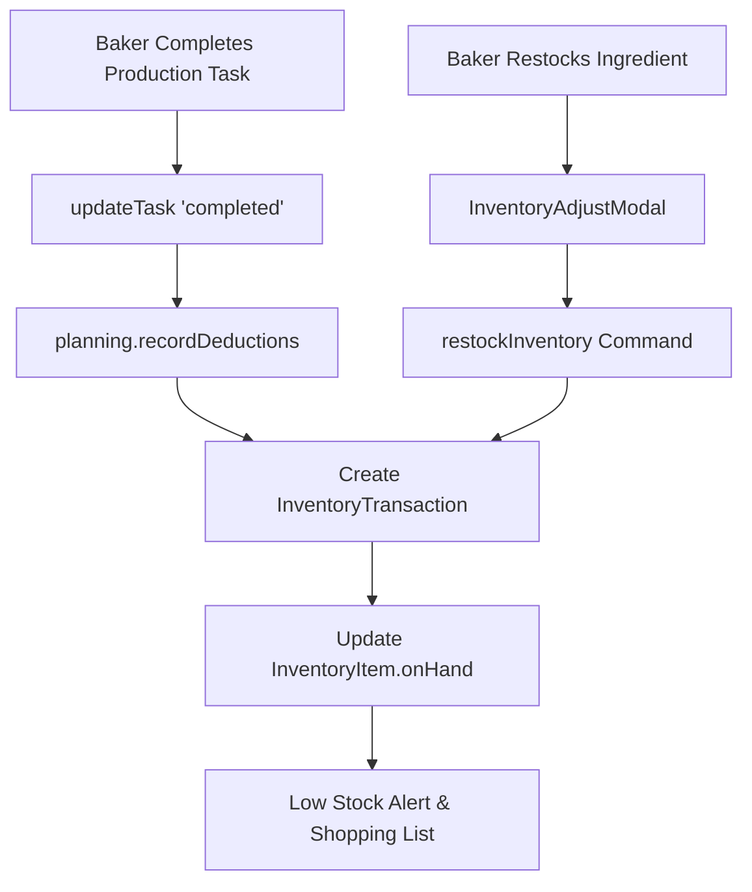

# Design: Automated Real-Time Inventory Movements & Deductions

## Architecture & Flow

## Detailed Component Specifications

### 1. Automatic Deductions Engine (`src/app/domain/localAdapter.ts`)
- On `updateTask(status = 'completed')`:
  - Calculate required ingredients using `calculateRequirements([task], builds, inventory)`.
  - Append deduction transaction `{ id, sourceKey: 'task-completion:taskId', itemId, quantityChange: -required, reason: 'task-completed' }`.
  - Update `onHand` count: `item.onHand += quantityChange`.

2. **Restock & Adjustment Modal (`src/app/components/inventory/InventoryAdjustModal.tsx`)**:
   - Modal for entering quantity added/adjusted, unit cost, supplier invoice #, and optional notes.
   - Triggers `restockInventory({ bakeryId, itemId, quantityAdded, notes })`.

3. **Shopping List & Reorder Drawer (`src/app/components/inventory/ShoppingListDrawer.tsx`)**:
   - Drawer computing shortages across all upcoming orders and min-level thresholds.
   - Lists: Item Name, On Hand, Required, Shortage Amount, Package Size, Estimated Reorder Cost.
   - Actions: "Export CSV", "Print Reorder Sheet".

## Acceptance Criteria
1. Completing a mixing or starter production task automatically deducts ingredient quantities from inventory on-hand balance.
2. Duplicate deductions are prevented when re-saving a completed task.
3. Bakers can log restock shipments (+quantity), which updates item stock and records a transaction.
4. Ingredients below minimum reorder levels appear in the Shopping List with one-click CSV export.
5. All Vitest unit tests and Playwright E2E browser tests compile and pass cleanly.
