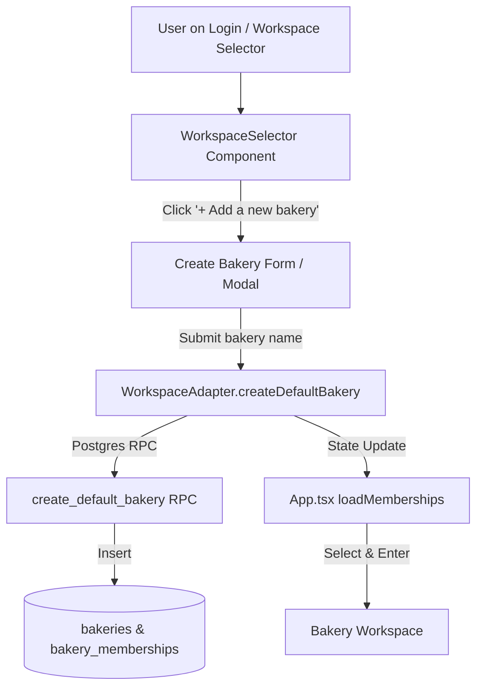

# Design: Add Multi-Bakery Creation Capability

## Architecture & Component Flow

## Detailed Changes

### 1. Database Layer (`supabase/migrations/`)
- Ensure `create_default_bakery` RPC function securely creates a new row in `bakeries`, generates an `owner` record in `bakery_memberships`, and returns the created `bakery_id`.

### 2. Workspace Adapters (`src/app/workspace.ts`)
- In `createMockWorkspaceAdapter`, update `createDefaultBakery(name)`:
  - Generate new `bakeryId` and `membershipId`.
  - Append `{ id: membershipId, bakeryId, bakeryName: name, role: "owner", isDefault: true }` to `memberships`.
  - Return `bakeryId`.

### 3. Workspace Selection Component (`src/app/WorkspaceSelector.tsx`)
- Modify `WorkspaceSelector`:
  - When `memberships.length > 0`, display the store radio list AND an "+ Add another bakery" button/card that toggles an inline creation form.
  - Submitting the form calls `onCreate(name)` which invokes `createDefaultBakery`, reloads memberships, and selects the new store.

### 4. Application Shell (`src/app/App.tsx`)
- Wire creation triggers from both `WorkspaceSelector` and sidebar/header store switchers.

## Acceptance Criteria
1. On login, users with 1 or more existing bakeries see both the store selection list and an option to create a new bakery.
2. Creating a new bakery adds it to the user's accessible stores and enters the new store workspace immediately.
3. All Vitest unit tests and Playwright E2E browser tests compile and pass cleanly.
