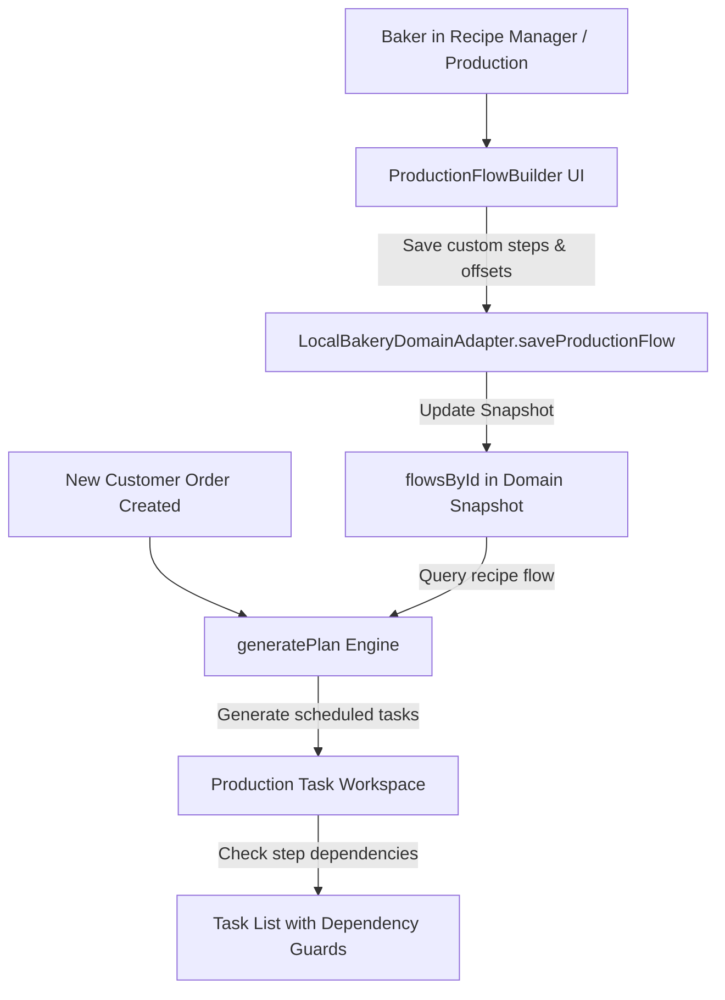

# Design: Production Flow Builder & Dynamic Task Scheduler

## Architecture & Data Flow

## Detailed Component Specifications

### 1. Production Flow Builder Component (`src/app/components/production/ProductionFlowBuilder.tsx`)
- Drag-and-drop or step list reordering.
- Form fields per step:
  - `name`: Step title (e.g. *Autolyse & Mix*)
  - `category`: `prep` | `starter` | `mixing` | `shaping` | `ferment` | `baking` | `packaging`
  - `dayOffset`: Day offset relative to pickup date (`-2`, `-1`, `0`)
  - `time`: Target time (`06:00` - `22:00`)
  - `duration`: Target duration in minutes
  - `instructions`: Detailed baker instructions
  - `dependsOn`: Select ID of prerequisite step
- Action buttons: "Add Step", "Save Production Flow", "Reset to Default".

### 2. Domain & Local Adapter (`src/app/domain/localAdapter.ts`)
- Add `flowsById` to `BakeryDomainSnapshot`.
- Seed default flows for `Sourdough Loaf` and `Focaccia`.
- Implement `saveProductionFlow` and `deleteProductionFlow` commands updating state.

### 3. Task Generation & Dependency Engine (`src/app/production.ts`)
- `generatePlan(order, flows)` looks up custom flow by `recipeId` / recipe name.
- Computes `dependencyIncomplete`: checks if `dependsOn` step for the same order item is not yet completed.

## Acceptance Criteria
1. Bakers can view, create, edit, and save custom production flows for any recipe.
2. Orders created with a custom recipe automatically schedule tasks using that recipe's custom step flow, day offsets, and target times.
3. Downstream tasks display dependency warnings if prerequisite tasks are incomplete.
4. All Vitest unit tests and Playwright E2E browser tests compile and pass cleanly.
