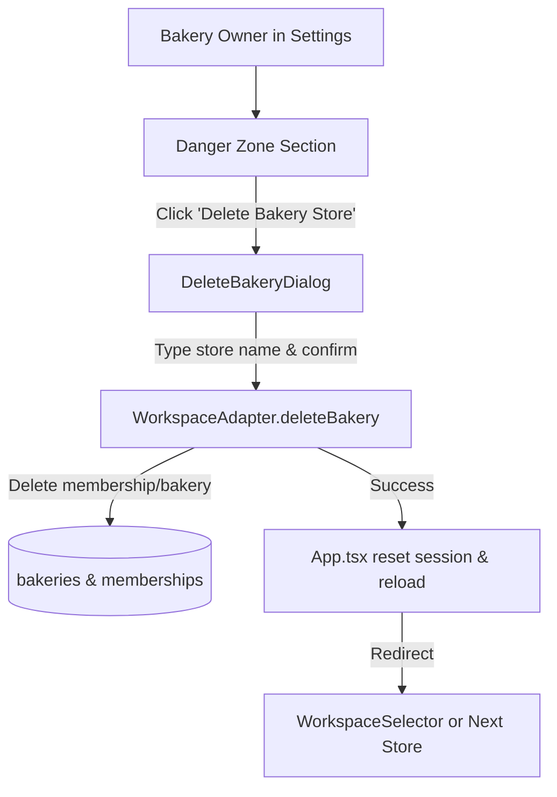

# Design: Delete Bakery Store in Settings

## Architecture & Component Flow

## Detailed Component Specifications

### 1. `WorkspaceAdapter` Interface (`src/app/workspace.ts`)
- Interface method: `deleteBakery(bakeryId: string): Promise<void>`
- Implementation details:
  - `createMockWorkspaceAdapter`: filter out `memberships` with `bakeryId`.
  - `createSupabaseWorkspaceAdapter`: invoke `client.rpc('delete_bakery', { target_bakery_id: bakeryId })` or delete from `bakeries`.

### 2. `DeleteBakeryDialog.tsx` (`src/app/DeleteBakeryDialog.tsx`)
- Modal dialog with warning banner.
- Input requiring exact match with `membership.bakeryName` (case-insensitive or exact).
- Action buttons: "Cancel" and "Permanently Delete Bakery" (disabled until name matches).

### 3. Settings Screen Integration (`src/app/SettingsScreen.tsx` / `App.tsx`)
- Danger Zone section appended to Settings:
  - Title: **Danger Zone**
  - Description: "Once deleted, all data for this bakery will be permanently removed."
  - Button: **Delete this bakery** (only active for `role === "owner"`).

## Acceptance Criteria
1. Only bakery owners can access and trigger bakery deletion in Settings.
2. The user must type the exact bakery name in the confirmation modal before the delete button activates.
3. Deleting a store removes it from the user's accessible stores list and immediately redirects them to their remaining store or the workspace selector landing screen.
4. All Vitest unit tests and Playwright E2E browser tests compile and pass cleanly.
